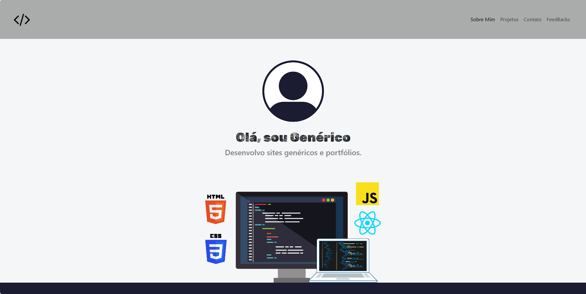
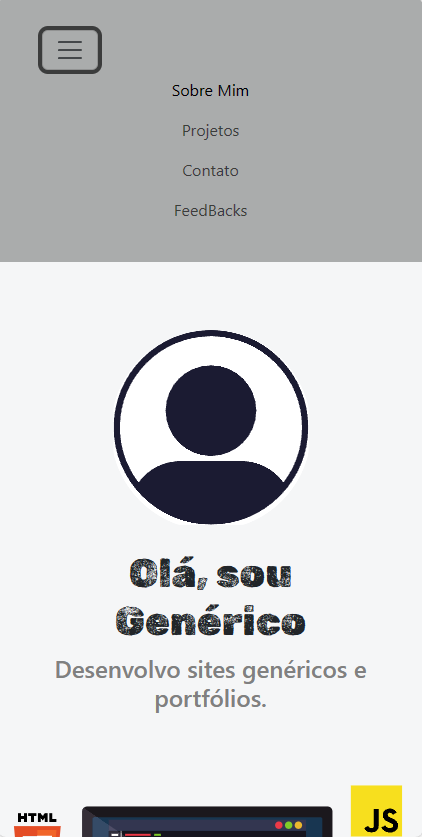

# **Porfólio Modelo**  
Portfólio modelo do curso de Bootstrap da freeCodeCamp (Espanhol)
______________________

# Como inicializar:
Inicie o arquivo index.html e conseguirá navegar.

Desktop:

Mobile:

# Sobre:

Esse projeto é um modelo de portfólio que encontrei em um curso de Bootstrap leccionado pela incrível professora Estefania Cassingena Navone (Head do freeCodeCamp Espanhol), cuja didática me moldou mais do que esperava.

Evoluções pessoais:
- Aprendi com uma organização impecável do código 
- Entendi mais sobre as meta tags, SEO e qualidade de referencial.
- Aprendi a customização de elementos não só para aplicações bootstrap.
- Entendi muito mais sobre responsividade
- Endendi perfeitamente sobre media querys 

Obrigado por ler até aqui!
11 98545-2742 (Whatsapp) 
